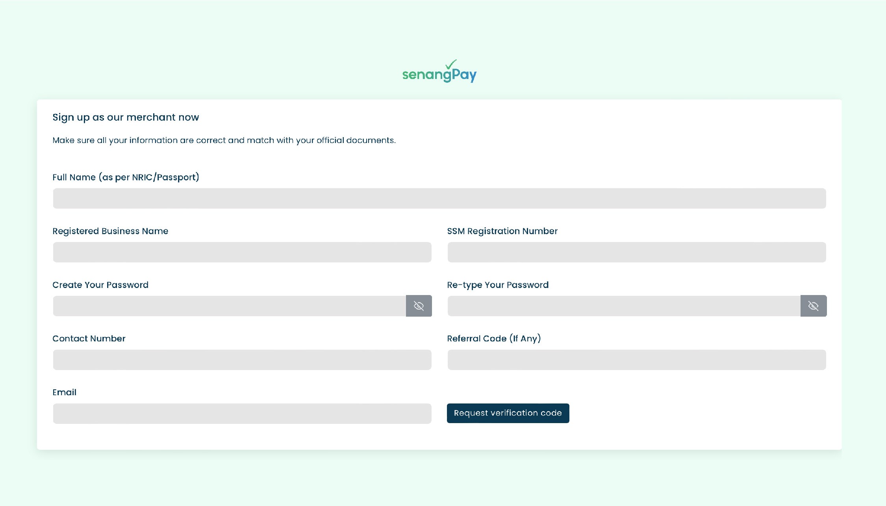

# User Registration

## Create a senangPay merchant account with us!

Ready to dive into seamless payments? Let’s get your business account set up in no time:

1\. Head over to the senangPay Registration page -> [Sign up here](https://register.senangpay.my/)&#x20;

2\. Fill in the blanks—your name, business name, email, phone number, and a rock-solid password.

3\. Choose a package and give the Terms and Agreement a quick nod and make a payment.

4\. You’re all set! Your business account is live. Now, let's move on to activating it—check out the next guide.

<figure><figcaption></figcaption></figure>

If you are looking to explore and test our products, you can register for sandbox account below.

## Set Up a senangPay Sandbox Account

While your senangPay Business Account handles real transactions in the live environment, the Sandbox Account is your playground for testing payments in a safe, simulated environment. Here’s how to create your senangPay Sandbox Account:

1\. Visit the senangPay Sandbox Registration page, [here](https://register-sandbox.senangpay.my/).

2\. Fill out the form with your full name, business name, email address, and choose a password.

3\. Agree to the Terms and Conditions and Privacy Policy, then make the payment.

4\. On the payment page, select **FPX and choose Maybank** at the Payment Detail section.

5\. Your senangPay Sandbox Account is now set up. Log in using the credentials you provided to start testing,. Log in here -> [https://register-sandbox.senangpay.my](https://register-sandbox.senangpay.my)&#x20;

<figure><figcaption></figcaption></figure>
