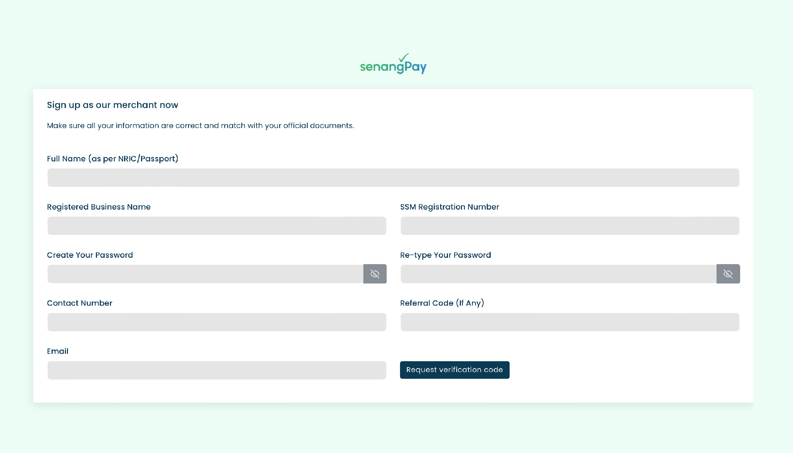

# User registration

### Create a senangPay merchant account with us.

Ready to dive into seamless payments? Learn how you to set up your business account:

1\. Head over to the [senangPay registration page](https://www.senangpay.com/register).

2\. Fill in the fields and choose a strong password.

3\. Choose a package, agree to the Terms of Agreement and make payment.

4\. Your business account is now live. Activate your account by following the steps provided in the welcome e-mail.

<figure><figcaption></figcaption></figure>

If you are looking to explore and test our products, you can register for a sandbox account below.

### Set up a senangPay sandbox account

While your senangPay business account handles real transactions in the live environment, the sandbox account is your playground for testing payments in a safe, simulated environment. Here’s how to create a senangPay sandbox account:

1\. Visit the senangPay sandbox registration page [here](https://register-sandbox.senangpay.my/).

2\. Fill in the fields and choose a password.

3\. Agree to the Terms and Conditions and Privacy Policy, then proceed to make a payment.

4\. On the payment page, select **FPX and choose Maybank** at the "Payment Detail" section.

5\. Your senangPay sandbox account is now set up. [Log in](https://sandbox.senangpay.my/) using the credentials you provided to start testing.

<figure><figcaption></figcaption></figure>
